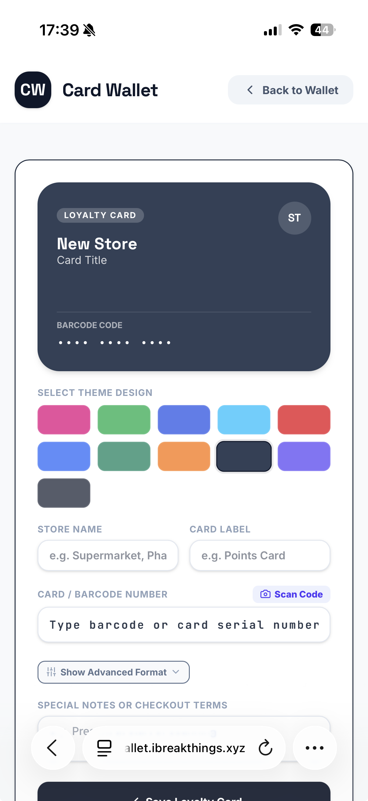

# Card Wallet

A simple mobile wallet for storing and sharing customer loyalty cards and coupon cards. Add a card by typing its number, scanning it with your camera, or uploading a photo — the barcode/QR format is detected automatically and rendered as a live, scannable code at checkout.

<p align="center">
  
</p>

## Features

- Store loyalty cards and coupons, each with its own color theme
- Add a code by typing it, scanning it with the camera, or uploading a photo
- Auto-detects barcode format (CODE128, EAN-13, EAN-8, UPC-A) and QR codes
- Renders a live, scannable barcode/QR at checkout
- Share a card with a link (`/share/:id`) that imports it into another wallet
- Optional expiry date and notes per card
- Works offline via `localStorage`, syncs to a SQLite backend when online

## Tech stack

- React 19 + Vite
- Express server
- SQLite (via `sqlite`/`sqlite3`)
- Tailwind CSS

## Run locally

**Prerequisites:** Node.js

1. Install dependencies:
   `npm install`
2. Copy `.env.example` to `.env.local` and fill in the values.
3. Run the app:
   `npm run dev`

The app runs at http://localhost:3000.

## Build

```
npm run build
npm run start
```

## Run with Docker

```
docker build -t card-wallet .
docker run -p 3000:3000 -v card-wallet-data:/app card-wallet
```

Or pull the published image with Docker Compose. Meant to run behind a reverse proxy (e.g. Coolify/Traefik) — the container only `expose`s port 3000, it isn't published to the host:

```
docker compose up -d
```

## Deployment

Every push to `main` builds and publishes a Docker image to GitHub Container Registry via [.github/workflows/docker-build.yml](.github/workflows/docker-build.yml), tagged `ghcr.io/ivucicev/cardwallet:latest`.
